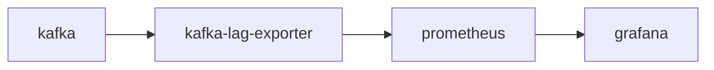

### 前言
为什么会有这个需求？

kafka consumer 消费会存在延迟情况，我们需要查看消息堆积情况，就是所谓的消息Lag。目前是市面上也有相应的监控工具KafkaOffsetMonitor，我们自己也写了一套监控kmanager。但是随着kafka版本的升级，消费方式也发生了很大的变化，因此，我们需要重构一下kafka offset监控。

如何计算Lag?
在计算Lag之前先普及几个基本常识

LEO(LogEndOffset): 这里说的和官网说的LEO有点区别，主要是指堆consumer可见的offset.即HW(High Watermark)

CURRENT-OFFSET: consumer消费到的具体位移

知道以上信息后，可知Lag=LEO-CURRENT-OFFSET。计算出来的值即为消费延迟情况。

### 官方查看方式

这里说的官方查看方式是在官网文档中提到的，使用官方包里提供的bin/kafka-consumer-groups.sh

最新版的工具只能获取到通过broker消费的情况

```
$ bin/kafka-consumer-groups.sh --describe --bootstrap-server 192.168.0.101:8092 --group test
Consumer group 'test' has no active members.

TOPIC              PARTITION  CURRENT-OFFSET  LOG-END-OFFSET  LAG             CONSUMER-ID     HOST            CLIENT-ID
truman_test_offset 2          1325            2361            1036            -               -               -
truman_test_offset 6          1265            2289            1024            -               -               -
truman_test_offset 4          1245            2243            998             -               -               -
truman_test_offset 9          1310            2307            997             -               -               -
truman_test_offset 1          1259            2257            998             -               -               -
truman_test_offset 8          1410            2438            1028            -               -               -
truman_test_offset 3          1225            2167            942             -               -               -
truman_test_offset 0          1218            2192            974             -               -               -
truman_test_offset 5          1262            2252            990             -               -               -
truman_test_offset 7          1265            2277            1012            -               -               -

```

### 真正开始

前面都是万能网友提供的一些基础知识和介绍，现在正式开始我们的解决方案。 我们采用 kafka-lag-exporter + prometheus + grafana 的方式， 原因很简单，我们的大部分业务都在k8s上，所有主流的监控都在上面。 [kafka-lag-exporter](https://github.com/lightbend/kafka-lag-exporter) 也不需要安装额外的插件，只需要能连接到kafka即可。 流程也很简单。



这个项目介绍的极其详细，支持k8s helm 部署。 由于我这里暂时还不需要部署集群直接使用examples/standalone 提供的脚本部署。

修改application.conf的相关信息 例如：bootstrap-brokers。 然后直接执行 run-docker.sh 即可。默认暴露端口为8000。

之后修改 Prometheus 的配置文件: 添加job

```
...
scrape_configs:
  - job_name: 'kafka-lag-exporter'
    scrape_interval: 10s
    static_configs:
      - targets: ['xxx:8000']
        labels:
          job: 'kafka-lag-exporter'
...
```
最后使用该项目提供的 dashboard json 文件上传到grafana 就可以了。
