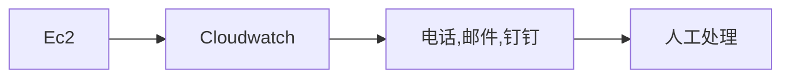
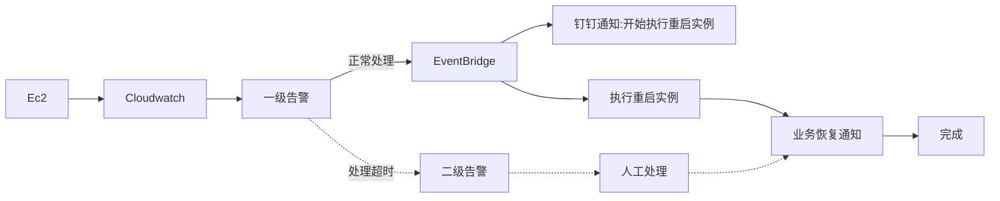

公司在aws ec2 有一些陈年老业务，这些业务比较臃肿不太方便加入到新的k8s集群，我们也没有太多精力去迁移过去。但是时不时来个僵死触发报警也是很难受。毕竟谁都不想半夜爬起来搞这个...
在此契机下研究了下故障自愈的一些事情。 发现市面上这块呼声最大的其实是蓝鲸平台，但它比较大而全,并不适合小体量公司，而大体量公司还不如自己搞。由于我们所有的业务基本都在aws上所以更倾向于采用aws自己的一些方案。
经过调研发现 cloudwatch + EventBridge 可以比较好的处理当前我们的一些问题。

### 当前的告警机制
首先看一下当前我们的告警以及处理方式，当实例异常通过cloudwatch进行告警，收到电话☎️或者邮件后，人工开始处理。
由于是处理通常是机械性的重启，而且经常发生在半夜，所以我们希望加入自动化手段处理这些告警。

<!-- more -->

### 改进后的告警机制

我们将告警进行了分级，一级告警和二级告警，当触发一级告警时由 EventBridge 获取这个告警事件，匹配规则，然后进行重启实例操作，同时将处理信息反馈到钉钉。当处理完成时也在钉钉反馈信息。二级告警是在一级告警触发超过一定事件没有恢复时触发，此时需要人工干预，介时人工进行处理。

通过这个机制将会节省很多人工干预的环节，减少了不少工作量。 另外发现了EventBridge 这个好工具，相信以后会在更多场景起到作用。
